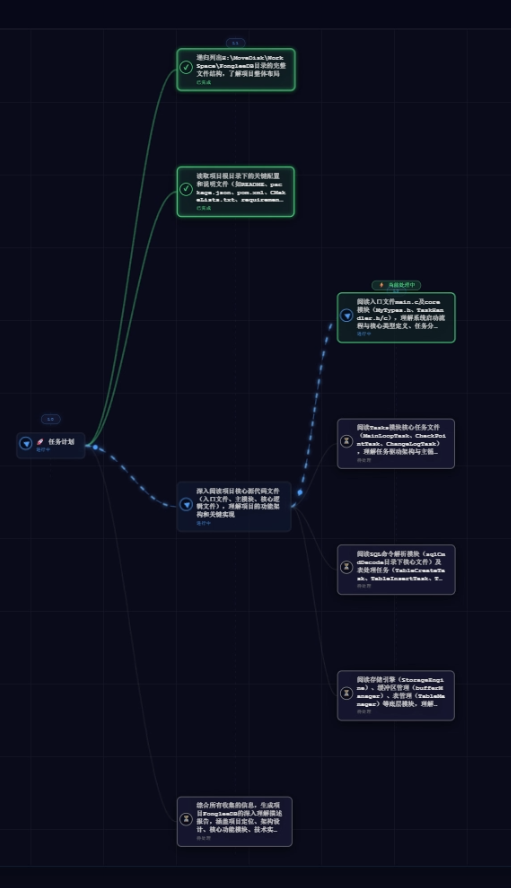
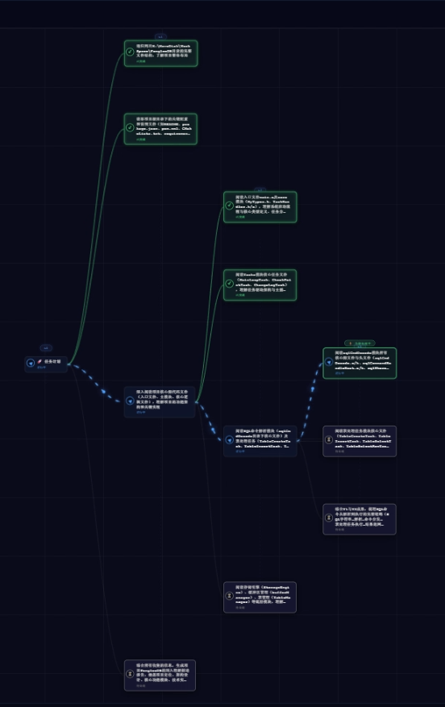

# Fongleevis-agent

> **A hierarchical, LLM-native Agent Runtime for long-horizon autonomous tasks.**

[](https://www.gnu.org/licenses/agpl-3.0)

[]()

---

## The Core Idea

Most Agents are built around a fundamentally linear execution loop:

```text
Goal
 ↓
LLM
 ↓
Tool
 ↓
Observation
 ↓
LLM
 ↓
Tool
 ↓
...
```

This works well for short tasks.

But as a task becomes longer and more complex, the Agent must continuously carry more historical decisions, observations, intermediate results, and unrelated subproblems in the same reasoning process.

Eventually, the problem is no longer simply **whether the model is intelligent enough**.

It becomes a problem of **how much the model is being asked to reason about at once**.

Fongleevis-agent takes a different approach:

> **Don't make one Agent solve the whole problem.
> Recursively structure the problem, isolate the reasoning context, and let the Runtime organize the work.**

The task tree is the core of the architecture.

---

# Adaptive Hierarchical Orchestration

Unlike a conventional planner that generates a fixed workflow or a simple multi-agent system that creates a predetermined set of subtasks, Fongleevis-agent uses a **dynamic, recursive, non-uniform execution tree**.

A task does not have a predetermined depth.

At every node, the LLM can decide:

```text
                    Task Node
                        │
                        ▼
                Is the task atomic?
                   /           \
                 Yes             No
                  │               │
                  ▼               ▼
               Execute        Decompose
                                  │
                         ┌────────┼────────┐
                         ▼        ▼        ▼
                       Child    Child    Child
                         │        │        │
                      Evaluate Evaluate Evaluate
                         │        │        │
                      Execute  Decompose Execute
                                  │
                             ┌────┴────┐
                             ▼         ▼
                           Child     Child
                             │
                          Decompose
                             │
                            ...
```

The result is an **adaptive tree whose depth emerges from task complexity**.

```text
                                  Root
                                    │
                  ┌─────────────────┼─────────────────┐
                  ▼                 ▼                 ▼
              Research           Backend           Deploy
                  │                 │                 │
            ┌─────┴─────┐           │                 │
            ▼           ▼           ▼                 ▼
         Sources      Analysis    Database          Execute
            │           │
        ┌───┴───┐       │
        ▼       ▼       ▼
       Web    Papers   Compare
                         │
                    ┌────┴────┐
                    ▼         ▼
                Evaluate   Validate
                              │
                         ┌────┴────┐
                         ▼         ▼
                       Test      Refactor
                                    │
                                    ▼
                                 Optimize
```

Simple branches can remain shallow.

Complex branches can recursively expand.

Different branches can have completely different depths.

> **Depth is not predetermined — it emerges from task complexity.**

This makes the task tree fundamentally different from a fixed workflow graph.

---

# Why This Matters: Cognitive Load Isolation

The purpose of the task tree is not merely to organize subtasks.

Its primary purpose is to **reduce the cognitive load of individual LLM reasoning steps**.

Consider a complex task containing:

* many independent subproblems
* hundreds of intermediate observations
* multiple execution paths
* different information requirements
* long historical context

A linear Agent tends to accumulate these into one execution history:

```text
Step 1
  ↓
Step 2
  ↓
Step 3
  ↓
Step 4
  ↓
...
  ↓
Step N
```

Every later reasoning step must potentially search through that growing history to determine what remains relevant.

Fongleevis-agent instead distributes complexity through the task hierarchy:

```text
                         Complex Goal
                              │
             ┌────────────────┼────────────────┐
             ▼                ▼                ▼
          Research          Build            Deploy
             │                │
        ┌────┴────┐       ┌───┴───┐
        ▼         ▼       ▼       ▼
      Sources   Analysis Backend   UI
                   │                │
                   ▼           ┌────┴────┐
                Compare         ▼         ▼
                              State   Components
                                         │
                                    ┌────┴────┐
                                    ▼         ▼
                                  Test     Refactor
```

Each node owns a **local objective**.

Each node can receive a **focused context**.

Each node only needs to reason about the complexity relevant to itself.

> **The Runtime does not simply give the LLM more context.
> It gives the LLM a smaller problem to think about.**

This is the fundamental architectural motivation behind hierarchical execution.

---

# Localized Context Compression

Long-running Agents inevitably need mechanisms for managing historical context.

The key difference is **where compression happens**.

In a linear execution model:

```text
Global History
──────────────────────────────────────────────────►

██████████████████████████████████████████████████
                         │
                         ▼
                    Compression
                         │
                         ▼
████████████████████░░░░░░░░░░░░░░░░░░░░░░░░░░░░
```

If important information is incorrectly compressed, the resulting information loss can affect the entire remaining execution.

Fongleevis-agent instead isolates history along the task hierarchy:

```text
                         Root
                          │
             ┌────────────┼────────────┐
             ▼            ▼            ▼
          Branch A     Branch B     Branch C
             │            │            │
          Local         Local         Local
          History       History       History
             │            │            │
         Compression  Compression  Compression
             │            │            │
             ▼            ▼            ▼
          A-local      B-local      C-local
```

A child task can compress its own execution history without requiring unrelated branches to discard their information.

This gives the architecture a different failure boundary:

> **Information loss is designed to remain local to the affected branch rather than becoming a global property of the entire task history.**

In other words:

> **Linear agents accumulate history.
> Hierarchical agents isolate history.**

And as task length increases, this distinction becomes increasingly important.

---

# Long-Horizon Execution

The architecture is designed specifically for tasks where execution may continue for a large number of reasoning and tool-interaction steps.

Instead of forcing the context of a single Agent to scale with the entire task:

```text
Task Complexity
       │
       ▼
Growing History
       │
       ▼
Growing Context
       │
       ▼
Compression
       │
       ▼
Potential Global Information Loss
```

Fongleevis-agent attempts to scale complexity structurally:

```text
Task Complexity
       │
       ▼
Hierarchical Decomposition
       │
       ├──────────────┐
       ▼              ▼
   Local Task      Local Task
       │              │
       ▼              ▼
   Local Context   Local Context
       │              │
       ▼              ▼
   Local History   Local History
```

The objective is not to claim that hierarchical execution automatically makes every task cheaper or more accurate.

The architectural goal is more specific:

> **As the task becomes longer, increase the structure of the execution rather than forcing every reasoning step to carry the entire task.**

This changes the scaling strategy of the Agent.

> **Don't make the context bigger.
> Make the problem smaller.**

---

# Recursive Planning Instead of Fixed Workflows

The tree is not necessarily generated completely before execution begins.

A node can be understood first and decomposed only when necessary.

For example:

```text
Root
 │
 ├── Research
 │     │
 │     ├── Search
 │     └── Analysis
 │            │
 │            ├── Compare
 │            └── Validate
 │
 ├── Implementation
 │     │
 │     ├── Backend
 │     └── Frontend
 │            │
 │            ├── Components
 │            │     ├── Test
 │            │     └── Refactor
 │            │
 │            └── State
 │
 └── Deployment
```

The Agent does not need to fully understand every descendant before beginning execution.

Instead:

```text
Understand
    ↓
Decide
    ↓
Execute or Decompose
    ↓
Observe
    ↓
Decide Again
    ↓
Execute or Decompose
    ↓
...
```

This creates a **deferred, recursive planning process**.

The system therefore does not require every possible workflow to be encoded by the developer in advance.

> **The developer provides the Runtime.
> The LLM determines the task structure.**

---

# LLM-Native Orchestration

Fongleevis-agent treats the LLM as the reasoning core of the Runtime rather than merely an API component inside a predefined workflow.

```text
User Goal
    │
    ▼
┌──────────────────────┐
│    Agent Runtime     │
│                      │
│ Task Orchestration   │
│ Context Management   │
│ Execution State      │
│ Tool Management      │
└──────────┬───────────┘
           │
           ▼
      LLM Reasoning
           │
           ▼
   Execute / Decompose
           │
           ▼
      Observe Result
           │
           └───────────────► Continue
```

The orchestration structure can therefore emerge dynamically from the task itself.

This is fundamentally different from encoding a workflow first and asking the LLM to fill in the individual steps.

---

# Beyond the Agent Harness

Agent Harnesses increasingly focus on making Agents reliable by providing:

* tools
* execution environments
* feedback loops
* verification
* permissions
* constraints
* observability

Fongleevis-agent addresses a complementary problem.

> **A Harness shapes the environment in which an Agent works.
> Fongleevis-agent also dynamically shapes the computational structure of the problem the Agent has to solve.**

Conceptually:

```text
                         Complex Goal
                              │
                              ▼
                ┌──────────────────────────┐
                │   Fongleevis Runtime     │
                │                          │
                │ Hierarchical Decomposition│
                │ Context Isolation         │
                │ Recursive Orchestration   │
                │ Result Aggregation        │
                └────────────┬─────────────┘
                             │
                             ▼
                       Execution Layer
                             │
                  ┌──────────┼──────────┐
                  ▼          ▼          ▼
                Tools     Feedback   Verification
                             │
                             ▼
                            LLM
```

The distinction is not that one replaces the other.

The distinction is where the system applies structure:

> **Harnesses improve the conditions under which an Agent executes.
> Fongleevis-agent focuses heavily on structuring the task itself.**

---

# Failure Containment

The hierarchical structure also creates natural boundaries around execution.

```text
                         Root
                    ┌─────┼─────┐
                    ▼     ▼     ▼
                    A     B     C
                   / \   / \    │
                  A1 A2 B1 B2   C1
                     │
                    A2a
                     │
                    A2a1
```

An execution failure, incorrect assumption, or excessive context accumulation can be associated with a specific branch rather than being inherently coupled to the entire execution history.

The same hierarchy therefore provides boundaries for:

* context
* execution state
* reasoning responsibility
* failure diagnosis
* local recovery

> **The task tree is not only an orchestration structure.
> It is also a containment structure.**

---

# Context Management

Context is treated as a Runtime resource rather than simply a property of the LLM.

The Runtime determines:

* what information should be retained
* what information should be passed to a child
* what information is relevant to the current node
* what historical information can be compressed
* which information belongs to a different execution branch

The basic model is:

```text
Parent Context
      │
      ▼
Context Analysis
      │
      ▼
Relevant Information
      │
      ▼
Child Context
      │
      ▼
Local Execution
```

This allows the Runtime to avoid treating the entire task history as equally relevant to every reasoning step.

---

# Independent Security Enforcement

Autonomous execution introduces a fundamental distinction between:

> **What the Agent wants to do**

and:

> **What the system allows it to do**

Fongleevis-agent therefore keeps security enforcement outside the Agent's reasoning authority.

```text
Agent Decision
      │
      ▼
 Tool Request
      │
      ▼
Security Layer
   │          │
   │          └──────────────┐
   ▼                         ▼
Allowed                   Sensitive
   │                         │
   ▼                         ▼
Execute                  Human Review
```

The Agent can request an operation.

It cannot redefine the policies governing that operation.

Sensitive operations can be presented to the user for explicit approval or rejection.

> **The Agent controls decisions.
> The security layer controls authority.**

This is particularly important when the Runtime is allowed to interact with real files, shells, and external environments.

---

# Structural Observability

Traditional Agent interfaces tend to represent execution as a conversation:

```text
User
 ↓
Thinking
 ↓
Tool
 ↓
Observation
 ↓
Thinking
```

Fongleevis-agent exposes the **execution structure itself**.

```text
                                Goal
                                  │
                 ┌────────────────┼────────────────┐
                 ▼                ▼                ▼
             Research           Build            Deploy
                 │                │
            ┌────┴────┐       ┌───┴───┐
            ▼         ▼       ▼       ▼
          Search    Analyze  Backend   UI
                      │                │
                      ▼           ┌────┴────┐
                   Compare         ▼         ▼
                                State    Components
                                            │
                                       ┌────┴────┐
                                       ▼         ▼
                                     Test     Refactor
```

Users can observe:

* how a goal was decomposed
* which node is currently executing
* which branches are complete
* which branches are still active
* where execution failed
* how subtasks relate to one another
* how deeply a particular task has been decomposed

This makes orchestration a visible part of the Agent experience rather than an opaque internal loop.

---

# Built by the Agent

The current frontend is itself part of the project's autonomous development story.

The current interface and task-tree visualization were implemented with the assistance of Fongleevis-agent itself.

This creates a useful demonstration of the Runtime's intended purpose:

> **The Agent is not only being demonstrated by the interface.
> The Agent is also being used to build the interface.**

---

# Real Environment Execution

Fongleevis-agent is designed to operate in real environments rather than only generate textual answers.

The Agent can interact with the environment through Tools:

```text
Agent Decision
      │
      ▼
   Tool Call
      │
      ▼
Real Environment
      │
      ▼
   Result
      │
      └──────────► Agent
```

Current execution support includes:

* Windows
* Linux
* Shell operations
* File and environment interaction through the Runtime's tool system

The architecture is designed around the assumption that useful autonomous systems must eventually be able to **inspect, modify, test, and operate on real environments**.

---

# Multi-Provider LLM Gateway

The Runtime includes a unified LLM access layer.

```text
                    Agent Runtime
                         │
                      Gateway
                         │
          ┌──────────────┼──────────────┐
          ▼              ▼              ▼
        Provider A    Provider B    Provider C
          │              │              │
          └──────────────┼──────────────┘
                         ▼
                    Local Models
```

The gateway provides a consistent interface for:

* multiple LLM providers
* model switching
* request management
* retry handling
* streaming
* provider abstraction

The orchestration layer does not need to be tightly coupled to a single model provider.

---

# Architecture

```text
                              User Goal
                                  │
                                  ▼
                       ┌───────────────────┐
                       │   Agent Runtime   │
                       └─────────┬─────────┘
                                 │
                         LLM-driven Planning
                                 │
                                 ▼
                    Adaptive Task Tree
                                 │
                 ┌───────────────┼───────────────┐
                 ▼               ▼               ▼
              Task Node       Task Node       Task Node
                 │               │               │
          ┌──────┴──────┐        │          ┌────┴────┐
          ▼             ▼        ▼          ▼         ▼
       Execute       Decompose Execute   Decompose  Execute
                         │
                    ┌────┴────┐
                    ▼         ▼
                  Child     Child
                    │
                 Decompose
                    │
                   ...
                                 │
                                 ▼
                         Local Context
                                 │
                                 ▼
                            Executor
                                 │
                                 ▼
                         Real Environment
                                 │
                                 ▼
                       Security Enforcement
                                 │
                                 ▼
                         Result Aggregation
                                 │
                                 ▼
                           Parent Node
```

The Runtime separates several concerns that are often coupled inside a single Agent loop:

| Layer             | Responsibility                                   |
| ----------------- | ------------------------------------------------ |
| **Reasoning**     | Determine what should be done                    |
| **Orchestration** | Determine how the task should be structured      |
| **Context**       | Determine what information a node should receive |
| **Execution**     | Perform operations through Tools                 |
| **Security**      | Determine what operations are authorized         |
| **Aggregation**   | Propagate completed work through the hierarchy   |
| **Visualization** | Expose execution structure to the user           |

---

# Current Capabilities

### Core Runtime

* ✅ LLM-native Agent Runtime
* ✅ Adaptive Hierarchical Task Orchestration
* ✅ Recursive Task Decomposition
* ✅ Dynamic Non-uniform Task Trees
* ✅ LLM-driven Task Planning
* ✅ Task-local Execution Context
* ✅ Adaptive Context Filtering
* ✅ Result Aggregation
* ✅ Execution State Management

### Execution

* ✅ Shell Tool
* ✅ Windows Environment
* ✅ Linux Environment
* ✅ Real Environment Execution
* ✅ Tool Execution Loop
* ✅ Streaming Support
* ✅ Retry Mechanism

### Safety

* ✅ Tool Security Control
* ✅ Independent Security Enforcement
* ✅ Sensitive Operation Review
* ✅ Human Approval / Rejection

### LLM Infrastructure

* ✅ Multi-provider LLM Gateway
* ✅ Model Abstraction
* ✅ Provider-independent Runtime
* ✅ Streaming / Non-streaming Execution

### Interface

* ✅ Task Tree Visualization
* ✅ Live Execution State
* ✅ Task Tree Animation
* ✅ Execution Monitoring
* ✅ Modern Web UI
* ✅ Dark / Light Interface

---

# UI Showcase

The frontend visualizes the Runtime's internal task structure rather than presenting execution as a flat conversation.





The interface is designed to make autonomous execution understandable without exposing the model's private reasoning process.

---

# Roadmap

## Adaptive Skill System

The next stage is to make capabilities themselves dynamically extensible.

Planned capabilities:

* dynamic Skill creation
* Skill loading and unloading
* capability modularization
* Agent-generated Skills
* runtime capability evolution

The long-term goal is for the Agent to be able to construct and extend capabilities when existing primitives are insufficient.

---

## Long-Term Memory

A persistent memory system is planned for information that should survive beyond an individual task or session.

The design direction includes:

* long-term memory
* associative relationships
* memory-strength updates
* deep memory retrieval
* persistent experience accumulation

The planned system is intended to be a **memory system rather than a conventional knowledge base**.

Domain knowledge and external information sources can instead be introduced through Skills.

---

# Design Principles

## Structure Before Intelligence

A more capable model does not automatically solve poor task organization.

Complexity should be structured before it is delegated to a single reasoning step.

---

## Complexity Determines Depth

The Runtime should not impose a fixed decomposition depth.

Simple tasks should remain simple.

Complex tasks should acquire additional structure only where that complexity actually exists.

> **Depth is a consequence of complexity, not a configuration parameter.**

---

## Context Is a Resource

More context is not necessarily better context.

The important question is not:

> How much context can the model accept?

It is:

> **What context does this reasoning step actually need?**

---

## Localize Complexity

When a task becomes more complex, increase the structure of the task rather than forcing every reasoning step to carry the entire problem.

---

## Localize Information Loss

Long-running execution will eventually require context management.

The architecture therefore attempts to ensure that context compression occurs within the smallest practical execution scope.

> **Do not compress the entire task when only one branch has become large.**

---

## Runtime Over Workflow

The goal is not to encode every possible workflow.

The goal is to provide a Runtime in which an LLM can dynamically construct the appropriate execution structure for the task at hand.

---

## Intelligence With Boundaries

The Agent should have substantial autonomy over reasoning and planning while remaining constrained by explicit Runtime and security boundaries.

---

# Quick Start

## Requirements

* Python 3.10+
* Windows or Linux
* LLM API key

## Windows

Double-click:

```text
start_for_windows.bat
```

## Linux

```bash
chmod +x start_for_linux.sh
./start_for_linux.sh
```

The startup script automatically:

1. checks the Python environment
2. creates `.venv`
3. installs dependencies
4. starts the Agent service

Then open:

```text
http://localhost:5000/agent
```

---

## Manual Startup

Install dependencies:

```bash
pip install -r requirements.txt
```

Create `.env`:

```env
LLM_PROVIDER=openai
OPENAI_API_KEY=your_api_key_here
```

Start the Runtime:

```bash
python run.py
```

---

# Environment

### Primary

* Windows

### Compatible

* Linux

---

# License & Commercial

Fongleevis-agent is licensed under the **GNU Affero General Public License v3.0 (AGPL-3.0)**.

AGPL-3.0 is intended to keep modifications and network-accessible deployments within the same open-source licensing model.

For proprietary integration, enterprise deployment, custom development, or other use cases that cannot comply with AGPL-3.0, commercial licensing is available.

### Commercial Licensing

Available for:

* proprietary integration
* enterprise deployment
* custom feature development
* deployment assistance
* technical support
* training and consulting

**Commercial inquiries:** [476706568@qq.com](mailto:476706568@qq.com)

---

# Author's Note

Fongleevis-agent started from a simple question:

> **If LLMs are becoming increasingly capable, what prevents them from reliably handling much larger and longer-running tasks?**

The answer is not always a more capable model.

Sometimes the problem is how the task is organized.

A highly capable LLM can still struggle when it is forced to maintain a single continuously growing execution history containing every decision, observation, subproblem, and unrelated piece of information.

This project therefore explores a different direction:

> **Instead of continuously expanding one Agent's context, recursively structure the problem and isolate the reasoning required at each level.**

The task tree is the core of this idea.

It is not merely a convenient way to display subtasks.

It is the Runtime's primary mechanism for controlling:

* cognitive load
* context boundaries
* execution structure
* information propagation
* failure containment
* long-horizon complexity

The tree is intentionally **dynamic and non-uniform**.

A task can be executed directly when it is sufficiently atomic, or recursively decomposed when the LLM determines that further structure is necessary.

As a result, the Runtime does not need to decide the final depth of a task before execution begins.

> **Simple work stays shallow.
> Complex work grows structure where it needs it.**

This leads to the central thesis of the project:

> **Don't make the Agent's context scale with the complexity of the task.
> Make the structure of the Runtime scale with the complexity of the task.**

The long-term goal is not simply to build another Agent with more tools.

It is to explore whether autonomous intelligence can be made more capable and controllable by giving it a better computational structure for reasoning and execution.

> **Don't make the context bigger.
> Make the problem smaller.**

> **Complexity is not a problem to be solved, but a structure to be organized.**

— Fongleevis
