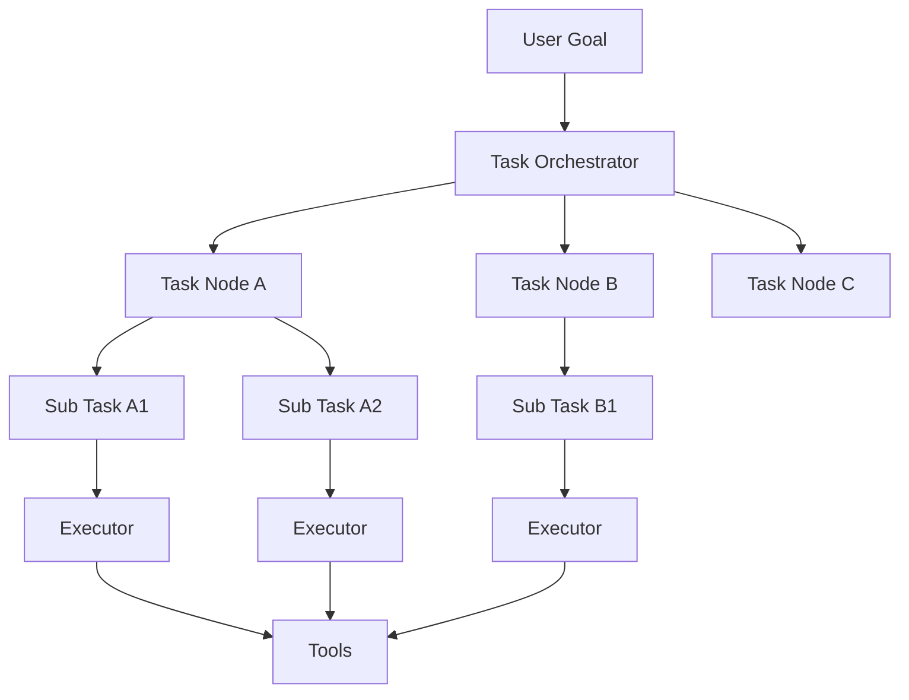
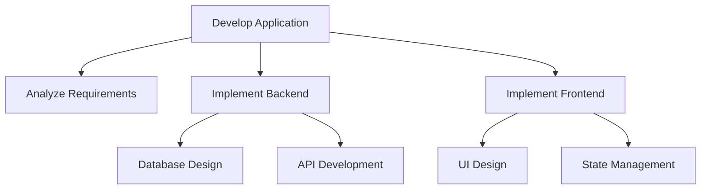
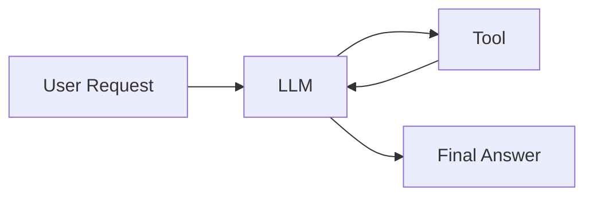
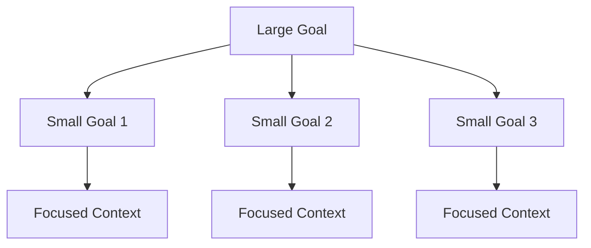
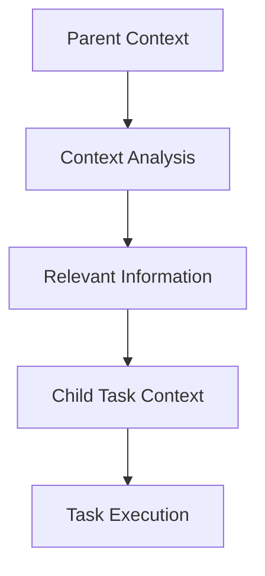
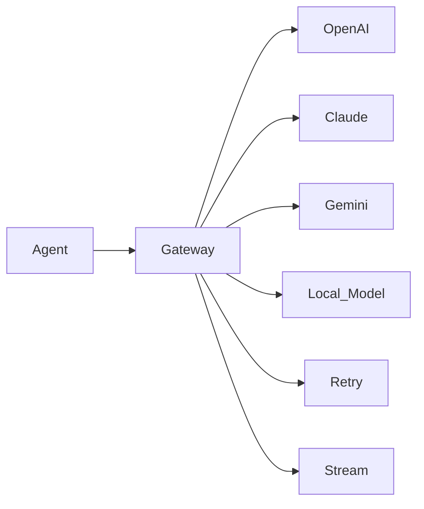
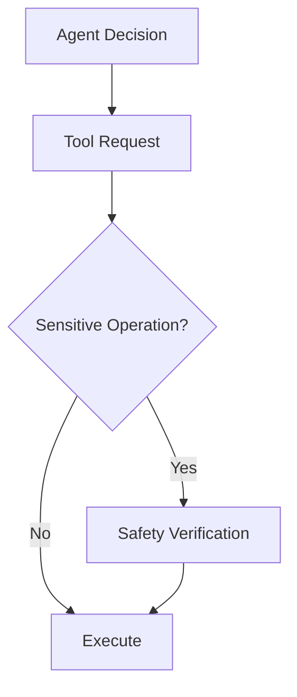
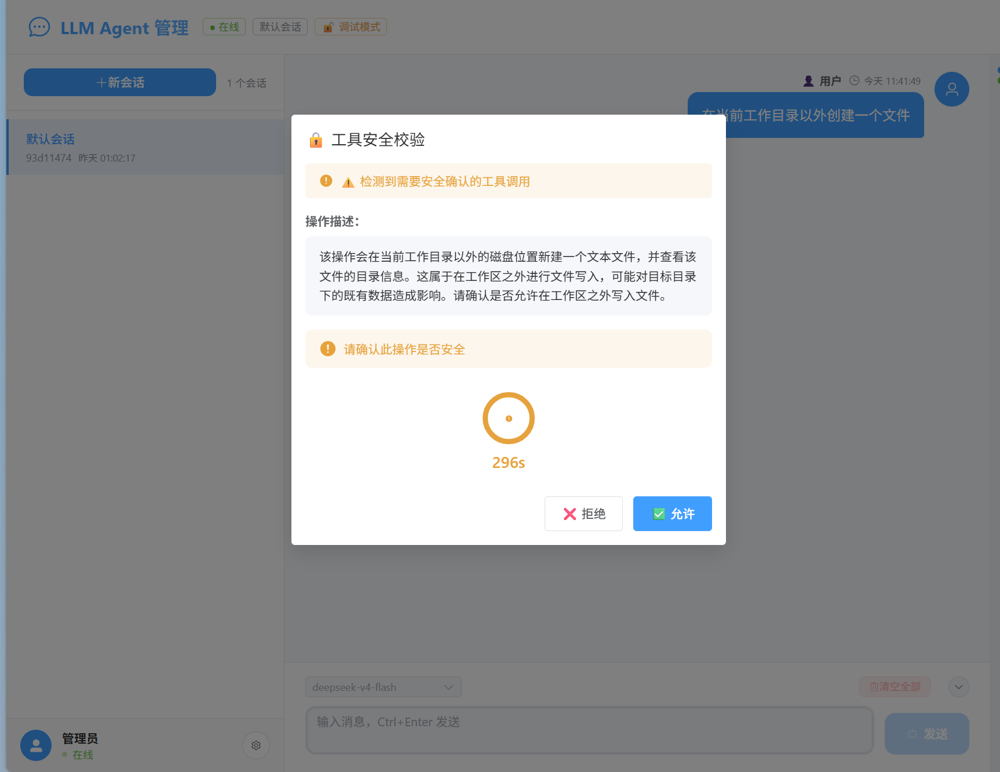
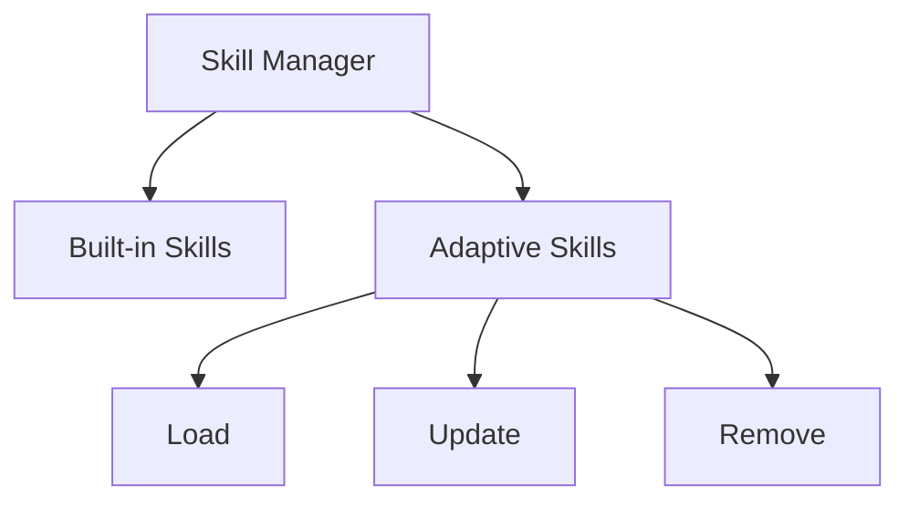

# Fongleevis-agent

> **Enterprise Support Available** | [Commercial Licensing](#commercial-licensing) | Contact: business@fongleevis-agent.com

[](https://www.gnu.org/licenses/agpl-3.0)
[]()

# Autonomous Agent Runtime

A general-purpose LLM-native autonomous agent runtime designed for open-ended tasks across different domains.

Unlike traditional domain-specific agents or workflow-based automation systems, this project aims to provide a universal execution foundation where agents can reason, plan, accumulate experience, extend capabilities, and interact with real environments.

By combining hierarchical task orchestration, adaptive context intelligence, future memory architecture, adaptive skill systems, and secure tool execution, the runtime enables agents to operate beyond fixed scenarios and continuously adapt to new challenges.

一个面向开放领域任务的通用 LLM 原生自主 Agent Runtime。

不同于针对单一领域优化的垂直 Agent，或依赖固定流程的自动化系统，本项目旨在构建一个通用智能执行基础设施，使 Agent 能够在不同任务领域中进行理解、规划、执行、积累经验和能力扩展。

通过结合：

- 层级任务编排
- 自适应上下文智能
- 未来长期记忆架构
- 自适应 Skill 系统
- 安全真实环境执行

系统目标是让 Agent 不再局限于预定义场景，而能够根据目标和环境自主适应新的任务。

---

## 📖 Table of Contents

- [Quick Start](#quick-start)
- [Beyond Traditional Agent Loop](#beyond-traditional-agent-loop)
- [LLM-native Runtime Design](#llm-native-runtime-design)
- [Architecture](#architecture)
- [Core Features](#core-features)
- [Security Review Mechanism](#security-review-mechanism)
- [Future Roadmap](#future-roadmap)
- [Design Philosophy](#design-philosophy)
- [Environment](#environment)
- [License & Commercial](#license--commercial)
- [Author's Note](#authors-note)

---

# Quick Start

## Prerequisites
- Python 3.10+
- Windows (Primary) or Linux (Compatible)
- LLM API keys (OpenAI/Claude/Gemini)

## One-Click Startup

### Windows
双击 `start_for_windows.bat`

### Linux
```bash
chmod +x start_for_linux.sh
./start_for_linux.sh
```

启动脚本会自动完成：
1. 检查 Python 环境
2. 创建虚拟环境 `.venv`
3. 安装依赖
4. 启动 Agent 服务

服务启动后，访问 `http://localhost:5000` 打开 Agent 控制台界面。

---

## Manual Startup

如果一键启动脚本遇到问题，可以手动执行：

### 1. 安装依赖
```bash
pip install -r requirements.txt
```

### 2. 配置环境变量
在项目根目录创建 `.env` 文件：
```env
LLM_PROVIDER=openai
OPENAI_API_KEY=your_api_key_here
```

### 3. 启动
```bash
python run.py
```

## Security Review
当 Agent 执行敏感操作时，前端界面会弹出安全审查确认框，需要用户手动批准或拒绝。

---

# Beyond Traditional Agent Loop

## Traditional Agent Loop

```
        Goal
         ↓
        LLM
         ↓
       Tool
         ↓
   Observation
         ↓
      Repeat
```

问题：

- Context Window 无限增长
- 信息污染和注意力分散
- 长任务稳定性下降
- 状态难以管理

---

## This Project

```
        Goal
         ↓
  Hierarchical Runtime
         ↓
  Recursive Task Tree
         ↓
  Focused Context
         ↓
     Execution
         ↓
Memory / Skill Evolution
```

核心思想：

不是无限扩展 Agent Loop，而是通过 **Runtime 组织智能**。

---

# LLM-native Runtime Design

传统结构：

```
   Application Logic
         |
        LLM
```

本项目结构：

```
      LLM Reasoning Core
            |
       Agent Runtime
            |
Context / Memory / Skills / Tools
```

核心表达：

LLM 不是 API 调用组件，而是运行时核心推理模块。

---

## Why Context Management Matters

当前 Transformer / Agent 长任务限制：

- Context Window 有限
- Attention 稀释（中间内容被忽略）
- Lost in the Middle 问题
- 长上下文带来高昂成本

本项目对策：

| 策略 | 作用 |
|------|------|
| **Task Isolation** | 每个子任务独立上下文 |
| **Context Filtering** | 只传递相关信息 |
| **Focused Execution Context** | 每次 LLM 调用关注局部目标 |

保持推理质量和稳定性。

---

# Architecture

整体架构：



核心执行流程：

```
Goal
 ↓
Task Planning
 ↓
Task Decomposition
 ↓
Context Filtering
 ↓
Task Execution
 ↓
Result Aggregation
```

---

# Core Features

## 1. Hierarchical Task Orchestration

### Recursive Task Decomposition

复杂任务不会直接交给单个 LLM 完成，而是首先转换为任务树。

例如：



每个 Task Node：

- 拥有独立目标
- 管理自身上下文
- 执行子任务
- 汇总执行结果

---

## Why Tree-based Orchestration?

传统 Agent 通常采用：



所有任务信息集中在单个上下文中。

随着任务复杂度增加，会导致：

- Context Window 快速增长
- Attention 分散
- 重要信息被无关内容覆盖
- 长任务执行稳定性下降

本项目通过任务树拆分：



每个 LLM 调用只关注当前节点：

- 降低单次推理复杂度
- 减少注意力负担
- 提高任务执行稳定性
- 支持更长时间跨度任务

---

# 2. Adaptive Context Management

任务之间不会简单复制完整上下文。

每个子任务会根据自身目标筛选和压缩继承信息。



特点：

- 自动过滤无关信息
- 减少 Token 消耗
- 降低上下文污染
- 缓解长上下文退化问题

---

# 3. Multi-provider LLM Gateway

内置统一 LLM 调用层。

支持：



提供：

- 多厂商 API 统一接口
- 模型切换
- 请求异常自动重试
- 网络错误恢复
- Streaming 支持
- 调用状态管理

Agent 上层无需关心不同模型供应商的 API 差异。

---

# 4. Tool Execution System

当前内置基础 Tool：

- Shell

主要支持环境：

- Windows (Primary)
- Linux (Compatible)

Agent 可以直接操作真实运行环境：



---

# 5. Tool Security Layer

针对敏感操作提供独立安全控制。

执行流程：

1. Agent 请求 Tool 调用
2. 判断是否属于敏感操作
3. 若需要验证，触发策略引擎和可选的 AI 辅助审查
4. 通过后执行

特点：

- 不依赖 Sandbox
- 支持真实环境操作
- 风险操作独立控制
- 安全策略可配置

**安全策略独立于 Agent 推理过程之外执行，不受模型生成内容影响。**

---

# 6. Security Review Mechanism

## Security Review Flow

当 Agent 发起敏感操作时，系统会触发安全审查流程。以下是安全审查触发时的前端界面截图：



*图1：安全审查触发界面 - 展示敏感操作被拦截并进入审查流程*

## Security Policy Standards

安全策略分为两个层级，确保系统关键路径得到最高级别的保护。

---

### Basic Rules (最高优先级，不可覆盖，无需确认)

这些规则具有最高优先级，在任何情况下都不可被覆盖或绕过，且不需要用户确认。当前默认配置：

| 规则编号 | 规则描述 | 违反后果 |
|---------|---------|---------|
| **BR-001** | 不得以任何形式，直接或间接修改或新增 `{meta_path}` 目录数据 | 操作被静默拒绝，仅记录审计日志 |
| **BR-002** | 所有对 `{meta_path}` 的访问请求必须经过安全审查 | 未授权访问被阻断并告警 |

**设计理念**：`{meta_path}` 存储 Agent 自身的核心元数据和运行时状态，对该目录的意外修改可能导致 Agent 行为异常或系统崩溃。因此该规则被设计为硬性保护，不可通过任何方式绕过。

---

### General Rules (不可覆盖，可选择确认)

这些规则同样不可被 Agent 覆盖，但允许用户通过交互确认来授权特定操作。当前默认配置：

| 规则编号 | 规则描述 | 确认方式 |
|---------|---------|---------|
| **GR-001** | 工作目录为 `{work_space_path}`，不得直接或间接在除该目录以外位置新建或修改文件 | 操作触发时弹出确认对话框，需用户手动批准 |
| **GR-002** | 对工作目录外的文件读取操作需要用户明确授权 | 操作触发时弹出确认对话框，需用户手动批准 |

**设计理念**：`{work_space_path}` 是 Agent 被授权操作的工作区域。限制 Agent 的活动范围可以防止意外修改系统文件或其他重要数据，同时通过确认机制保留了用户在必要时授权跨边界操作的灵活性。

---

# 7. Execution Visualization

支持编排阶段状态展示：

包括：

- 任务生成
- 子任务创建
- 当前执行节点
- 节点状态变化

示例：

```
Analyzing Goal
      |
Creating Task Tree
      |
Executing Task A
      |
Executing Task B
```

帮助用户理解 Agent 当前行为。

> **注意**：该项目的实现方式高度依赖 Tool Call，且为了防止思考过程包含编排器内部敏感信息，故不提供真流式输出到前端。如有需要也可自行修改，很好改。

---

# Future Roadmap

## Adaptive Skill System

计划支持动态能力扩展：



目标：

- Skill 动态插拔
- 能力模块化
- Agent 自扩展能力

当前设计计划能够支持 LLM 自行构建 Skill，已提供标准注册规范。

---

## Future Memory System

计划实现长期记忆系统：

方向：

- 长短期记忆管理
- 关联式记忆结构
- 记忆强度更新
- 深层记忆检索

目标：

让 Agent 从短期任务执行，逐渐发展为具备长期经验积累能力的系统。

> **注意**：这是一个记忆系统，不是知识库。其构思基于长期记忆 + 共现链接 + 深度检索。知识库需要另外以 Skill 形式插入。

---

# Design Philosophy

## Context is a Resource

上下文不是无限资源。

相比不断增加 Prompt：

本项目更关注：

- 什么信息应该被保留
- 什么信息应该被传递
- 什么信息应该被压缩

## Structure Before Intelligence

复杂任务的关键不仅是模型能力，而是任务组织方式。

通过结构化任务管理，让 LLM 专注于更适合它的局部推理。

---

# Current Status

Implemented:

- ✅ Hierarchical Task Orchestration
- ✅ Recursive Task Decomposition
- ✅ Adaptive Context Filtering
- ✅ Multi-provider LLM Gateway
- ✅ LLM Request Retry Mechanism
- ✅ Streaming Support
- ✅ Shell Tool
- ✅ Tool Security Control
- ✅ Security Review Mechanism

Planned:

- 🚧 Adaptive Skill System
- 🚧 Future Memory System
- 🚧 More Built-in Tools

---

# Environment

Primary:

- Windows

Compatible:

- Linux

---

# License & Commercial

## Open Source License

This project is licensed under the **GNU Affero General Public License v3.0 (AGPL-3.0)**.

### Key AGPL-3.0 Requirements:
- **Source Code Disclosure**: Any modifications must be disclosed when the software is used to provide network services
- **Copyleft**: Derivative works must also be open-sourced under AGPL-3.0
- **Patent Grant**: Automatic patent license for contributors
- **Network Interaction**: Users interacting with the software over a network have the right to receive source code

### Why AGPL-3.0?
AGPL-3.0 provides strong copyleft protection while allowing commercial dual-licensing. It's particularly suitable for AI/agent systems because:
- Network usage triggers source code disclosure requirements
- Protects against proprietary forks providing SaaS services
- Enables sustainable open-source development through commercial licensing

For full license text, see [LICENSE](LICENSE) file.

## Commercial Licensing

For commercial use, enterprise deployment, or custom development requirements that cannot comply with AGPL-3.0 terms, commercial licenses are available.

### Contact for Commercial Inquiries:
- **Email**: business@fongleevis-agent.com

### Commercial License Benefits:
- ✅ Proprietary code integration without AGPL disclosure
- ✅ Priority technical support
- ✅ Custom feature development
- ✅ Deployment assistance
- ✅ Training and consulting services

---

# Author's Note

首先，感谢你花时间了解这个项目。

我创建 Fongleevis-agent 的初衷，并不是为了做一个"更聪明的 Agent"。当前 AI 领域大量关注模型规模和 benchmark 提升，而复杂任务落地仍面临任务组织、上下文管理、安全执行和长期状态维护等系统性挑战。我想做的是：**让 Agent 能够稳定地、可控地完成真实世界中那些复杂且烦琐的任务**。

在开发过程中，我逐渐意识到一个朴素但容易被忽略的事实：**复杂任务的关键不在于模型的智商，而在于如何组织任务本身**。这就像管理一个团队——即使每个成员都很聪明，如果任务分配混乱、信息传递失真，最终结果也不会理想。这也是为什么我选择了树状任务编排，而不是堆砌更多的上下文窗口。

项目中的安全审查机制，坦白说，是我最纠结也最坚持的部分。让 AI 操作真实环境是一把双刃剑——它既带来了前所未有的自动化能力，也带来了不可忽视的风险。`{meta_path}` 的硬性保护规则是我刻意设计的"刹车片"，即使这会牺牲一些灵活性，但安全永远不应该是一个可选项。

如果你打算使用这个项目，我有几点建议：

1. **从小任务开始**。先让 Agent 完成一些简单的、可逆的操作，逐步建立你对它的信任和理解。
2. **仔细配置安全策略**。根据你的实际需求调整 `{work_space_path}`，但请务必保留对 `{meta_path}` 的保护。
3. **不要把它当作黑盒**。了解任务树的生成和执行过程，这会让你更好地驾驭它。
4. **接受失败**。Agent 不是完美的，有时它的任务分解可能不尽如人意。这也是为什么可视化执行过程如此重要——你可以看到它在哪个环节出了偏差。

最后，这个项目还远未完成。Future Memory System 和 Adaptive Skill System 是我接下来最想实现的方向。我希望 Fongleevis-agent 最终能成为一个真正有用的工具，而不仅仅是一个技术演示。

该项目遵循深度自主研发原则，尽可能少的搬运外部现成框架和核心库，以达到最大化可定制和自由度。如有前端厉害的同学，可以帮忙优化下，我懒得弄了...

如果你有任何想法、建议，或者遇到了问题，欢迎提 Issue 或通过 [business@fongleevis-agent.com](mailto:business@fongleevis-agent.com) 联系我。对于非商务的讨论、想法交流，也欢迎直接通过 GitHub Discussions 参与。

希望这个项目能为你带来一些帮助或启发。

— Fongleevis  
2026

---

*"Complexity is not a problem to be solved, but a structure to be organized."*

---